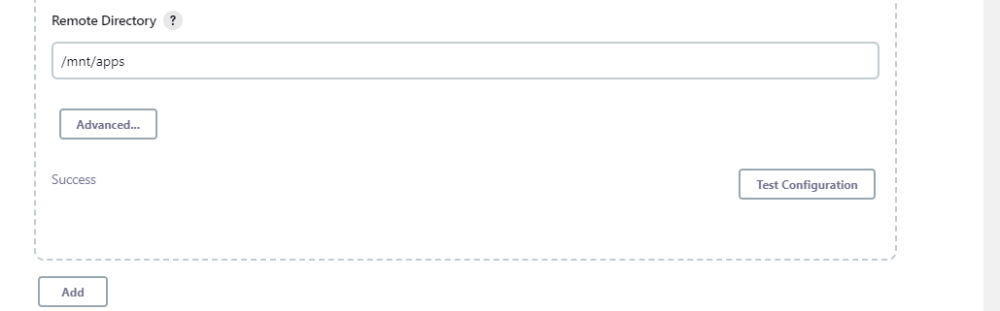

## Step 1 – Install Jenkins server

## Create an AWS EC2 server based on Ubuntu Server 20.04 LTS and name it "Jenkins"

`sudo apt update`

`sudo apt install default-jdk-headless`

`wget -q -O - https://pkg.jenkins.io/debian-stable/jenkins.io.key | sudo apt-key add -
sudo sh -c 'echo deb https://pkg.jenkins.io/debian-stable binary/ > \
    /etc/apt/sources.list.d/jenkins.list'`

`sudo apt update`

`sudo apt-get install jenkins`

`sudo systemctl status jenkins`

## Step 2 – Configure Jenkins to retrieve source codes from GitHub using Webhooks

## Step 3 – Configure Jenkins to copy files to NFS server via SSH

